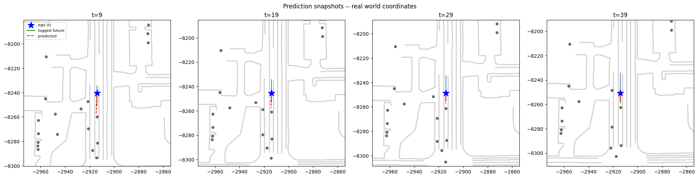

# Waymax Experiments

This project is about learning how a self driving car might understand the
world around it and predict where it will go next.

The starting idea was pretty simple: when we drive, we don't pay attention to
everything around us. We only really track a handful of things that matter,
and we often already know where we're headed (like a turn coming up) well
before we get there. The goal here was to try building something along those
lines, where a model learns to focus on the agents and parts of the scene
that actually matter, instead of treating everything around it as equally
important.

## What exists right now

A model that looks at a driving scene (nearby cars, the road layout, traffic
lights) from the car's own frame of reference, and predicts the car's future
trajectory.

The architecture has three encoder branches:

- Agents (everything except the ego car): each one gets a short history
  window of position, heading, and velocity, run through its own GRU, plus
  an embedding for its object class (vehicle, pedestrian, cyclist).
- Static map points (lane markings, stop signs, crosswalks): passed through
  an MLP, each point's type also gets its own learned embedding, since these
  don't move over time so there's no need for a GRU here.
- Traffic lights: same idea as agents, a GRU over history, since light state
  changes over time, plus an embedding for the current state.

Each branch pools its items (agents, map points, or lights) into one vector
using a softmax over a learned relevance score per item, instead of a plain
average. This is the main design choice in the project: the model decides
how much to weight each surrounding car or map point rather than treating
all of them as equally important, and padded/invalid slots get a weight of
exactly zero through the softmax's minus infinity trick.

The three pooled vectors are concatenated together with the ego car's own
current yaw and speed, and this combined vector is passed through a decoder
MLP that outputs the predicted future trajectory directly.

Everything (positions, velocities, map points, light positions) is
transformed into the ego car's own coordinate frame before being fed in,
since what matters for driving is where something is relative to you, not
its position in some arbitrary global frame.

It's trained and tested on real driving logs from the Waymo Open Motion
Dataset, using the Waymax simulator. There are some visualizations too, the
real driving clip alongside what the model predicted, so it's easy to see how
it's actually doing rather than just looking at a loss number.



A note on scale: the full dataset has hundreds of thousands of scenarios, and
what's been run so far only uses a portion of it, capped mainly to keep
training times reasonable while things are still being worked out. Worth
keeping in mind when looking at any numbers here, they're not yet from the
full dataset.

## What this could become

Right now the model just predicts a full trajectory in one go. The next step
would be to combine this learned understanding of the scene with a proper
planner, one that thinks a few seconds ahead and keeps adjusting as things
change, rather than committing to one plan and sticking with it.

There's also more to explore around the "only pay attention to a few things"
idea itself, being more selective about which agents actually matter, tied to
where the car is actually headed, rather than looking at everyone nearby all
the time.


## Repo layout

```
src/
  transforms.py   ego frame conversions
  model.py         the model itself
  extract.py       pulls one training example out of a scenario
  dataset.py       splits data into train, val, test
  train.py         the training loop
  visualize.py     playback and prediction plots
  metrics.py       ADE, FDE
notebooks/
  explore.ipynb
weights/
  stage1_weights.pth
```
