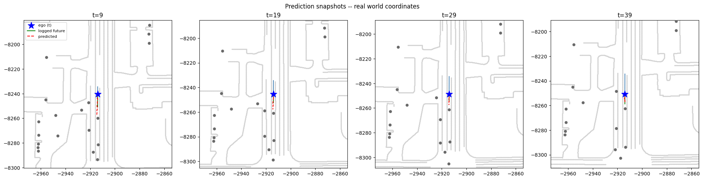

# Waymax Experiments

This project is about learning how a self driving car might understand the
world around it and predict where it will go next.

The starting idea was pretty simple: when we drive, we don't pay attention to
everything around us. We only really track a handful of things that matter,
and we often already know where we're headed (like a turn coming up) well
before we get there. The goal here was to try building something along those
lines, where a model learns to focus on the agents and parts of the scene
that actually matter, instead of treating everything around it as equally
important.

## What exists right now

A model that looks at a driving scene (nearby cars, the road layout, traffic
lights) from the car's own frame of reference, and predicts the car's future
trajectory.

The architecture has three encoder branches:

- Agents (everything except the ego car): each one gets a short history
  window of position, heading, and velocity, run through its own GRU, plus
  an embedding for its object class (vehicle, pedestrian, cyclist).
- Static map points (lane markings, stop signs, crosswalks): passed through
  an MLP, each point's type also gets its own learned embedding, since these
  don't move over time so there's no need for a GRU here.
- Traffic lights: same idea as agents, a GRU over history, since light state
  changes over time, plus an embedding for the current state.

Each branch pools its items (agents, map points, or lights) into one vector
using a softmax over a learned relevance score per item, instead of a plain
average. This is the main design choice in the project: the model decides
how much to weight each surrounding car or map point rather than treating
all of them as equally important, and padded/invalid slots get a weight of
exactly zero through the softmax's minus infinity trick.

The three pooled vectors are concatenated together with the ego car's own
current yaw and speed, and this combined vector is passed through a decoder
MLP that outputs the predicted future trajectory directly.

Everything (positions, velocities, map points, light positions) is
transformed into the ego car's own coordinate frame before being fed in,
since what matters for driving is where something is relative to you, not
its position in some arbitrary global frame. As of the latest retrain, this
transform is time-matched (each historical instant uses the ego's own state
*at that instant*, not its state right now) rather than anchoring the whole
history window to a single current-instant pose -- matters most for
velocity, and mostly during turns/braking (see `src/transforms.py`).

It's trained and tested on real driving logs from the Waymo Open Motion
Dataset, using the Waymax simulator. There are some visualizations too, the
real driving clip alongside what the model predicted, so it's easy to see how
it's actually doing rather than just looking at a loss number.



A note on scale: the full dataset has hundreds of thousands of scenarios, and
what's been run so far only uses a portion of it, capped mainly to keep
training times reasonable while things are still being worked out. Worth
keeping in mind when looking at any numbers here, they're not yet from the
full dataset.

The latest retrain (10 epochs, `weights/stage1_weights_tau.pth`) lands at
test loss=1.07, ADE=0.82m, FDE=2.07m over the 3s prediction horizon. Val loss
plateaus around epoch 4-8 and ticks back up slightly by epoch 9 -- a mild
overfit/plateau signal, not a "needs way more data" one. The model still
shows a general bias toward continuing the ego's current motion rather than
committing to a maneuver change (most visible on turns, but not
turn-specific) -- under investigation, likely some mix of maneuver-scenarios
being a minority of the training distribution and the single-trajectory MSE
decoder structurally hedging under ambiguity.

## Stage 2: closed-loop MPC planner

On top of the Stage 1 encoder, `src/dynamics.py` + `src/mpc.py` +
`src/closed_loop.py` add a receding-horizon planner: the encoder's predicted
trajectory becomes a reference, `mpc.py` samples cone-constrained candidate
control sequences around it, scores them against a collision/progress/
comfort cost (with other agents projected forward via IDM car-following,
each one path-following its own logged route's curvature rather than a
frozen heading), and executes the first control of whichever candidate wins
before replanning from the new real state. `closed_loop.py` wires this into
a real per-step simulation where both the ego and other agents run their own
dynamics instead of replaying the log.

Status: implemented and unit-tested against synthetic scenarios (see
`tests/`), architecturally compatible with the retrained encoder (no code
changes needed to use `stage1_weights_tau.pth`), but not yet run end-to-end
against a real Waymax scenario -- that verification is still pending.

## What this could become

The closed-loop planner above is the "combine with a proper planner" step
this section used to describe as future work -- now built, pending real-data
verification. From here:

- Confirm the closed-loop actually runs sensibly on a real scenario, and see
  how much the encoder's "keep doing the current thing" bias actually hurts
  it in practice (MPC's cone is anchored to the reference, so a bad
  reference constrains how far it can correct).
- A cheap diagnostic before reaching for bigger changes: mask out the
  agent/map/light branches at inference and see how much the prediction
  actually changes -- tells us whether the model is using scene context at
  all, or substantially just extrapolating its own current speed/heading.
- There's also more to explore around the "only pay attention to a few
  things" idea itself, being more selective about which agents actually
  matter, tied to where the car is actually headed, rather than looking at
  everyone nearby all the time -- deliberately deferred until the
  closed-loop planner above is confirmed working end-to-end.


## Repo layout

```
src/
  transforms.py    ego frame conversions (time-matched/tau, see above)
  model.py         the Stage 1 model itself
  extract.py       pulls one training example out of a scenario
  dataset.py       splits data into train, val, test
  train.py         the training loop
  visualize.py     playback and prediction plots
  metrics.py       ADE, FDE
  dynamics.py      kinematic bicycle model (Stage 2)
  mpc.py           cone-constrained MPC + IDM car-following (Stage 2)
  closed_loop.py   wires encoder -> MPC -> dynamics into a real rollout (Stage 2)
tests/
  test_mpc.py            dynamics/mpc unit tests, synthetic data
  test_closed_loop.py    closed-loop wiring + path-following agent tests
  test_transforms.py     time-matched (tau) vs decision-instant (t) regression test
weights/
  stage1_weights.pth        pre-tau baseline
  best_weights_v2.pth       pre-tau baseline, best-of-run
  stage1_weights_tau.pth    current -- trained on time-matched features
```
